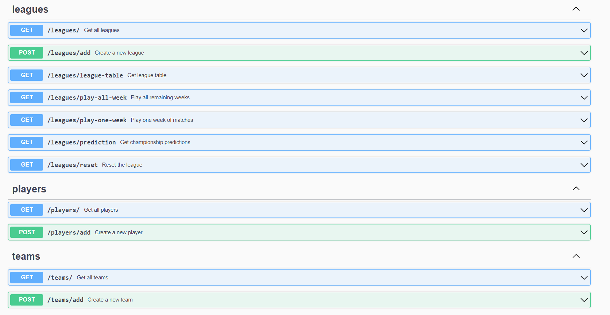

# Back-end Case

In this project, we expect you to complete a simulation. In this simulation, there will be a group of football teams and the simulation will show match results and the league table. Your task is to estimate the final league table.

**League Rules**

- There will be four teams in the league (if you wish, you can choose teams that have different strengths and you can determine the results of the matches depending on the strengths of these selected teams).
- Other rules in the league (scoring, points, goal difference, etc.) will be the same as the rules of the Premier League. (<http://www.premierleague.com/en-gb/matchday/league-table.html>)


As can be seen in Figure 1.a and Figure 2.a, each screen of the subsequent week will represent the league table and update the match status. Moving forward both the point scores and the results of the matches will be represented by this screen. In addition, after the 4th week, your estimation will also be represented on this screen.

**Limitations / Requirements:**

- The Project needs to be completed using GoLang (Projects that are completed in JAVA, .net, Ruby etc. will not be taken into consideration.).
- Please use OOP
- Frontend is not required for this task. Make sure that your code is easy to understand using your endpoints (e.g. via Postman). Also you can change the structure and logic  however you like. Documentation is a plus.
- Please handover the setup and deployment of your projects. If you deploy your Project and share  your project’s access link, it is a plus.
- We expect from you to send your code at the end of the project, with SQL scheme and queries.

**Extras** ​(Including the following extras to your project will be regarded as a strong plus)

- After you click on the all-League Play button, play the matches automatically until the end of the
- League and list the results of the matches by weeks.
- Edit the results of the matches and calculate the edited results of the matches based on the content  of the modified standings.

# Premier League Simulation

This project is a football league simulation web application developed using the Go programming language. The application runs on the Gin framework, utilizes PostgreSQL for the database, and uses GORM as the ORM library. Mapstructure is employed to map database models to request/response structs. The project is designed following the RESTful request-response architecture.

## Technologies Used

- **Go Programming Language**: The primary programming language used in the project.
- **Gin**: Fast and minimalist web framework for Go.
- **PostgreSQL**: Relational database management system.
- **GORM**: ORM library for Go.
- **Mapstructure**: Library used for mapping database models to request/response structures.
- **Postman and Swagger**: Tools used for testing and documenting APIs.

## Installation

1. **Install Go**: Download and install Go from the [official Go website](https://golang.org/).
2. **Install PostgreSQL**: Download and install PostgreSQL from the [official PostgreSQL website](https://www.postgresql.org/). Create a database and note down the connection details.
3. **Install Gin, GORM, and Mapstructure**: Run the following commands in your terminal to install the required packages:

   ```bash
   go get -u github.com/gin-gonic/gin
   go get -u gorm.io/gorm
   go get -u github.com/mitchellh/mapstructure

4. **Clone and Set Up the Project: Clone the project repository and install dependencies.** 

    ```bash
    git clone <project_git_url>
    cd <project_directory>
    go mod tidy

## Usage

1. **Database Connection:** Configure PostgreSQL database connection settings in `config/config.go`.

2. **Run the Application:** Start the application by running the following command:

   ```bash
   go run main.go
   
3. **API Endpoints:** Use the endpoints listed in the table below to test the application's functionalities.

    | Endpoint                | HTTP Method | Description                                |
    |-------------------------|-------------|--------------------------------------------|
    | `/teams/`               | GET         | Get all teams.                             |
    | `/teams/add`            | POST        | Create a team.                             |  
    | `/players/`             | GET         | Get all teams.                             |
    | `/players/add`          | POST        | Create a team.                             |
    | `/leagues/`             | GET         | Get all leagues.                           |
    | `/leagues/add`          | POST        | Create a league.                           |
    | `/leagues/league-table` | GET         | Get current league table.                  |
    | `/leagues/play-one-week`| GET         | Play one week.                             |  
    | `/leagues/play-all-week`| GET         | Play all week.                             |
    | `/leagues/prediction`   | GET         | Weekly prediction of the champion.         |
    | `/leagues/reset`        | GET         | Reset league and points of teams           |


4. **Project Packages Model**

    ```
    ├── main
    ├──├──config
    ├──├──dtos
    ├──├──handlers
    ├──├──models
    ├──├──repositories
    ├──├──routers
    ├──├──services
    ```
## Models


## Swagger 



## Postman Collection 

https://www.postman.com/dparlar33/workspace/insider/collection/18597490-b9e56a1f-8e98-4506-b545-3807b5bea829 


## Result

- While creating a player, you have to enter existed `team_id`.
- While creating a team, you have to enter existed `league_id`.
- When the new player created, the value and capacity of the team will increase.
- The score of the match depends on the value, title, won, lost fields of the teams.
- With the `/league/reset` endpoint, week of the league and the won, lost, point of the team can be reset.
- Each team's points are updated every week, and the goals of all teams change based on the matches they win, transfers they make, including adding players.
- The likelihood of becoming champions changes according to the standings that change every week.

## Missing

- Update endpoints of Models (PUT).
- Delete operations of Models (DELETE).
